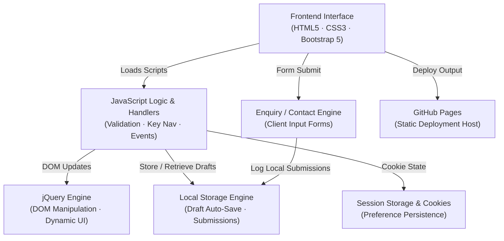

# Glitch & Grit

**Glitch & Grit  is a modern, accessible client-site web design, created as the freelancing company. It features the creation of websites, designs, and digital experiences that elevate your brand and bring your vision to life.**

**This will solve the problem of small oragnization who cannot afford expensive developers fee or the freelancing agency who charge expensive fee to create even an small project . Here we provide a lot of budget option for the clinet according to their project demand.**

**This Freelancing Agency "Glitch & Grit " Will contain Home , Portfolio , Team , Testimonials , Contact to enquire about the project and budget with the team .**

**There will be 5 branches in total seperate for each page**
## 🏗️ Architecture

```mermaid
flowchart TD
    A["Frontend (HTML · CSS · Bootstrap)\nUI · Layout · Components"]
    B["JavaScript Logic\nForm Handling · Validation · Events"]
    C["jQuery\nDOM Manipulation · AJAX (optional)"]
    D["Local Storage\nSave Projects · User Data"]
    E["Session Storage\nTemporary Session ID · Page State"]
    F["Project Data JSON\nSkills · Portfolio Items"]
    G["Contact / Enquiry Form\nClient Messages"]
    H["Deployment\nGitHub Pages"]

    A -->|loads scripts| B
    A -->|Bootstrap styling| A
    B -->|DOM actions| C
    B -->|store/retrieve| D
    B -->|session id| E
    B -->|fetch projects| F
    A -->|submit enquiry| G

    G -->|store locally| D
    F -->|project list| A

    H -->|static hosting| A
Here is a complete, polished, and professional **`README.md`** designed specifically for your **Glitch & Grit** repository based on all your project files and source code:

---

# ⚡ Glitch & Grit — Digital Agency Web Application

> **Where innovation meets craftsmanship.**
> *Glitch & Grit* is a modern, accessible, client-side web application built for a digital freelancing agency[cite: 8, 11, 15]. It bridges the gap between small organizations and high-quality web development, providing versatile, budget-conscious solutions for digital branding, design, AI, games, and cloud services[cite: 8, 15].

---

## 🌟 Key Features

* **👁️ Accessibility First (High-Contrast Mode):**
Includes a toggleable High-Contrast accessibility mode designed for low-vision users[cite: 8]. User preference is saved across sessions using browser `localStorage`[cite: 9].
* **💾 Client-Side Form Draft & Storage Engine:**
* **Auto-Save Drafts:** Automatically retains user progress in the project enquiry form so no data is lost upon refresh[cite: 16].
* **Automated Expiry Queue:** Stores active enquiry submissions with a 12-hour self-clearing lifespan (`12 * 60 * 60 * 1000` ms)[cite: 16].
* **Local Confirmation Dispatch:** Generates and logs interactive confirmation emails tied directly to unique submission IDs (`SUB-1`, `MAIL-xxx`) in local storage[cite: 16].


* **🎨 Modern Glassmorphism & Adaptive UI:**
* Custom UI styled with Google Font **Space Grotesk**[cite: 7, 10, 13].
* Animated glassmorphism cards (`backdrop-filter: blur`), floating heroes, custom scrollbars, and interactive element hovers[cite: 7].
* Integrated looping ambient background video (`gg1.png.mp4`)[cite: 10, 11].


* **⌨️ Enhanced UX Interactions:**
* **Smart Navigation:** Pressing `Enter` automatically advances focus to the next logical form input field[cite: 9].
* **Real-time Character Counter:** Dynamic 1,000-character limit counter with warning indicators for project detail descriptions[cite: 8, 9].
* **Interactive Portfolio Filtering:** Filterable project categories including *Branding*, *Web Design*, *Motion*, and *Print*[cite: 14].


* **🍪 Cookie Consent Management:**
Animated initial-load modal interface managing user session cookie choices[cite: 10, 11, 12].

---

## 📁 Repository & Page Structure

```text
├── 📄 index.html           # Landing page with video hero & cookie consent modal
├── 🎨 index.css            # Styles for video background & home layouts
├── 📄 portfolio.html       # Client showcase, skill cards & filterable projects
├── 🎨 portfolio.css        # Card grids & portfolio showcase styling
├── 📄 enquiry.html         # Project inquiry form & contact information
├── 🎨 enquiry.css          # Glassmorphism form styles & high-contrast definitions
├── 📄 team.html            # Agency team members showcase page
├── 📄 testimonial.html     # Client reviews and testimonials page
├── 📂 js/
│   ├── 📜 enquiry.js       # Form UX, high-contrast toggle, enter key jumps
│   ├── 📜 storage.js       # Draft saving, submission logs & email dispatch engine
│   ├── 📜 validation.js    # Client-side form validation rules
│   └── 📜 cookie.js        # Cookie modal state management
└── 📂 images / videos/     # Media assets, logos, and ambient video files

```

---

## 💼 Included Services & Budget Options

Through the interactive project enquiry interface, clients can select customized budget brackets and timelines[cite: 8]:

| Category | Available Options |
| --- | --- |
| **Services Offered** | Web Design, UI/UX, Web/App Development, AI, Game Dev, Cloud Solutions[cite: 8] |
| **Budget Brackets** | Under £4,000 · £4,000 - £10,000 · £10,000 - £20,000 · £20,000+[cite: 8] |
| **Project Timelines** | Urgent (<4 weeks) · Short (1-2 mos) · Medium (2-5 mos) · Long term (5+ mos)[cite: 8] |

---

## 🏗️ Architecture Flow



---
🌟 Key Features
👁️ Accessibility First (High-Contrast Mode):
Includes a toggleable High-Contrast accessibility mode designed for low-vision users[cite: 8]. User preference is saved across sessions using browser localStorage[cite: 9].

💾 Client-Side Form Draft & Storage Engine:

Auto-Save Drafts: Automatically retains user progress in the project enquiry form so no data is lost upon refresh[cite: 16].

Automated Expiry Queue: Stores active enquiry submissions with a 12-hour self-clearing lifespan (12 * 60 * 60 * 1000 ms)[cite: 16].

Local Confirmation Dispatch: Generates and logs interactive confirmation emails tied directly to unique submission IDs (SUB-1, MAIL-xxx) in local storage[cite: 16].

🎨 Modern Glassmorphism & Adaptive UI:

Custom UI styled with Google Font Space Grotesk[cite: 7, 10, 13].

Animated glassmorphism cards (backdrop-filter: blur), floating heroes, custom scrollbars, and interactive element hovers[cite: 7].

Integrated looping ambient background video (gg1.png.mp4)[cite: 10, 11].

⌨️ Enhanced UX Interactions:

Smart Navigation: Pressing Enter automatically advances focus to the next logical form input field[cite: 9].

Real-time Character Counter: Dynamic 1,000-character limit counter with warning indicators for project detail descriptions[cite: 8, 9].

Interactive Portfolio Filtering: Filterable project categories including Branding, Web Design, Motion, and Print[cite: 14].

🍪 Cookie Consent Management:
Animated initial-load modal interface managing user session cookie choices[cite: 10, 11, 12].


📁 Repository & Page Structure
├── 📄 index.html           # Landing page with video hero & cookie consent modal
├── 🎨 index.css            # Styles for video background & home layouts
├── 📄 portfolio.html       # Client showcase, skill cards & filterable projects
├── 🎨 portfolio.css        # Card grids & portfolio showcase styling
├── 📄 enquiry.html         # Project inquiry form & contact information
├── 🎨 enquiry.css          # Glassmorphism form styles & high-contrast definitions
├── 📄 team.html            # Agency team members showcase page
├── 📄 testimonial.html     # Client reviews and testimonials page
├── 📂 js/
│   ├── 📜 enquiry.js       # Form UX, high-contrast toggle, enter key jumps
│   ├── 📜 storage.js       # Draft saving, submission logs & email dispatch engine
│   ├── 📜 validation.js    # Client-side form validation rules
│   └── 📜 cookie.js        # Cookie modal state management
└── 📂 images / videos/     # Media assets, logos, and ambient video files

## 🚀 Getting Started

### Prerequisites

All you need is a modern web browser (Google Chrome, Mozilla Firefox, Microsoft Edge, or Safari).

### Local Setup

1. **Clone the repository:**
```bash
git clone https://github.com/aashishuk2026-spec/FreeLancing.git

```


2. **Navigate into the project directory:**
```bash
cd FreeLancing

```


3. **Open the application:**
Simply double-click `index.html` or open it using a local live server (e.g., VS Code *Live Server* extension).

---

## 🛠️ Built With

* **Markup & Layout:** [HTML5](https://developer.mozilla.org/en-US/docs/Web/HTML), [Bootstrap 5.3](https://getbootstrap.com/)[cite: 8, 11]
* **Styling & Fonts:** CSS Custom Properties, Glassmorphic Backdrop Filters, Google Font [Space Grotesk](https://fonts.google.com/specimen/Space+Grotesk)[cite: 7]
* **Scripting & DOM:** [JavaScript (ES6+)](https://developer.mozilla.org/en-US/docs/Web/JavaScript), [jQuery 3.7.1](https://jquery.com/)[cite: 8, 9]
* **Client Storage:** Web Storage API (`localStorage`, `sessionStorage`)[cite: 9, 16]

---

© 2026 **Glitch & Grit**. All rights reserved[cite: 8, 11, 14].


